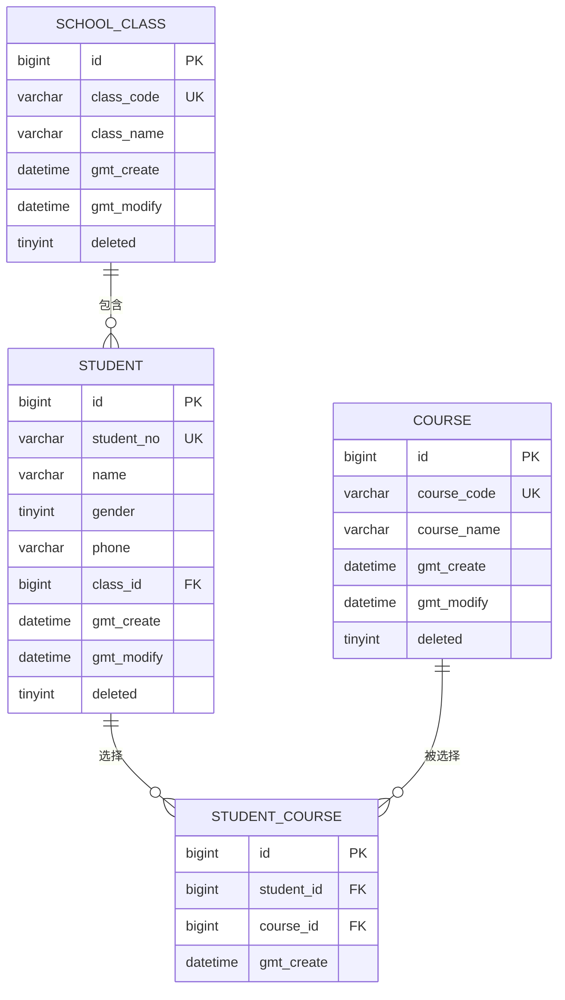

# 学生信息管理系统数据库设计

> 文档版本：V1.1
> 编写日期：2026-07-23
> 关联需求：[《学生信息管理系统需求文档》](./学生信息管理系统需求文档.md) V1.7
> 接口设计：[《学生信息管理系统接口详细设计》](./学生信息管理系统接口详细设计.md) V1.3
> 项目路径：`springboot-demo`
> 文档状态：第一期数据库设计基线

## 1. 文档目的

本文档定义学生信息管理系统第一期业务数据库的表结构、字段类型、主键、唯一索引、普通索引、外键、删除策略和建表顺序，作为后续建表 SQL、MyBatis-Plus 实体和接口详细设计的依据。

本文只设计以下4张业务表：

| 表名 | 作用 |
| --- | --- |
| `school_class` | 保存班级基础信息 |
| `student` | 保存学生基础信息及所属班级 |
| `course` | 保存课程基础信息 |
| `student_course` | 保存学生当前选择的课程 |

登录鉴权相关的 `sys_admin_user`、Redis Token 等属于脚手架公共技术能力，不在本文档中重复设计。

## 2. 数据库环境

| 项目 | 约定 |
| --- | --- |
| 数据库 | `springboot_demo` |
| MySQL 服务端 | MySQL 5.7.43 |
| JDBC 驱动 | MySQL Connector/J 8.0.33 |
| 存储引擎 | InnoDB |
| 字符集 | `utf8mb4` |
| 排序规则 | `utf8mb4_unicode_ci` |
| 应用时区 | `Asia/Shanghai` |
| 数据库连接时区 | `+08:00` |
| 主键策略 | `BIGINT AUTO_INCREMENT` |
| 时间精度 | `DATETIME(3)` |

`utf8mb4_unicode_ci` 默认不区分英文字母大小写。应用层仍需将学号、班级编码和课程编码去除首尾空格并统一转换为大写，保证存储格式一致。

## 3. 命名规范

### 3.1 数据库对象

- 表名和字段名使用小写蛇形命名法。
- 主键统一命名为 `id`。
- 创建时间统一命名为 `gmt_create`。
- 修改时间统一命名为 `gmt_modify`。
- 逻辑删除字段统一命名为 `deleted`。
- 唯一索引使用 `uk_表名_字段名`。
- 普通索引使用 `idx_表名_字段名`。
- 外键使用 `fk_子表_父表`。

### 3.2 Java 字段映射

项目已启用 MyBatis-Plus 下划线转驼峰，主要字段映射如下：

| 数据库类型 | Java 类型 | 示例 |
| --- | --- | --- |
| `BIGINT` | `Long` | `class_id` → `classId` |
| `VARCHAR` | `String` | `student_no` → `studentNo` |
| `TINYINT` | `Integer` | `deleted` → `deleted` |
| `DATETIME(3)` | `LocalDateTime` | `gmt_create` → `gmtCreate` |

## 4. 实体关系



关系说明：

- 一个班级可以包含零个或多个学生。
- 一个学生必须且只能属于一个未删除班级。
- 一个学生可以选择零门或多门课程。
- 一门课程可以被零个或多个学生选择。
- `student_course` 只保存当前选课关系，不保存成绩、学期、选课状态和历史记录。
- 班级和课程之间不建立直接关系，查询路径为“班级 → 学生 → 学生选课 → 课程”。

## 5. 表结构设计

### 5.1 班级表 `school_class`

#### 5.1.1 字段

| 字段 | 类型 | 允许空 | 默认值 | 键 | 说明 |
| --- | --- | --- | --- | --- | --- |
| `id` | `BIGINT` | 否 | 自增 | PK | 班级主键 |
| `class_code` | `VARCHAR(32)` | 否 | 无 | UK | 班级编码，统一大写 |
| `class_name` | `VARCHAR(100)` | 否 | 无 |  | 班级名称，允许重复 |
| `gmt_create` | `DATETIME(3)` | 否 | `CURRENT_TIMESTAMP(3)` |  | 创建时间 |
| `gmt_modify` | `DATETIME(3)` | 否 | `CURRENT_TIMESTAMP(3)` |  | 最后修改时间 |
| `deleted` | `TINYINT` | 否 | `0` |  | 逻辑删除：`0`正常，`1`删除 |

#### 5.1.2 约束与索引

```text
PRIMARY KEY (id)
UNIQUE KEY uk_school_class_class_code (class_code)
```

业务规则：

- `class_code` 全局唯一，保存前去除首尾空格并转换为大写。
- `class_name` 只用于展示，允许不同班级使用相同名称。
- 班级逻辑删除后，原 `class_code` 仍被唯一索引占用，不允许复用。
- 班级下仍存在未删除学生时，不允许删除班级。

### 5.2 学生表 `student`

#### 5.2.1 字段

| 字段 | 类型 | 允许空 | 默认值 | 键 | 说明 |
| --- | --- | --- | --- | --- | --- |
| `id` | `BIGINT` | 否 | 自增 | PK | 学生主键 |
| `student_no` | `VARCHAR(32)` | 否 | 无 | UK | 学号，统一大写 |
| `name` | `VARCHAR(50)` | 否 | 无 |  | 学生姓名，允许重复 |
| `gender` | `TINYINT` | 否 | `0` |  | 性别：`0`未知、`1`男、`2`女 |
| `phone` | `VARCHAR(20)` | 是 | `NULL` |  | 手机号，允许重复 |
| `class_id` | `BIGINT` | 否 | 无 | FK | 所属班级主键 |
| `gmt_create` | `DATETIME(3)` | 否 | `CURRENT_TIMESTAMP(3)` |  | 创建时间 |
| `gmt_modify` | `DATETIME(3)` | 否 | `CURRENT_TIMESTAMP(3)` |  | 最后修改时间 |
| `deleted` | `TINYINT` | 否 | `0` |  | 逻辑删除：`0`正常，`1`删除 |

#### 5.2.2 约束与索引

```text
PRIMARY KEY (id)
UNIQUE KEY uk_student_student_no (student_no)
KEY idx_student_class_deleted (class_id, deleted)
FOREIGN KEY (class_id) REFERENCES school_class (id)
```

业务规则：

- `student_no` 全局唯一，保存前去除首尾空格并转换为大写。
- 学号创建后不可通过普通修改接口变更。
- 学生逻辑删除后，原学号仍被唯一索引占用，不允许复用。
- `name` 允许重复。
- `phone` 可选、允许重复；未填写时保存 `NULL`，不保存空字符串。
- `class_id` 必填。新增或修改学生时，应用层必须确认班级存在且 `deleted = 0`。
- `gender` 的取值范围由接口校验和业务层保证。MySQL 5.7 不使用无法可靠执行的 `CHECK` 约束。

### 5.3 课程表 `course`

#### 5.3.1 字段

| 字段 | 类型 | 允许空 | 默认值 | 键 | 说明 |
| --- | --- | --- | --- | --- | --- |
| `id` | `BIGINT` | 否 | 自增 | PK | 课程主键 |
| `course_code` | `VARCHAR(32)` | 否 | 无 | UK | 课程编码，统一大写 |
| `course_name` | `VARCHAR(100)` | 否 | 无 |  | 课程名称，允许重复 |
| `gmt_create` | `DATETIME(3)` | 否 | `CURRENT_TIMESTAMP(3)` |  | 创建时间 |
| `gmt_modify` | `DATETIME(3)` | 否 | `CURRENT_TIMESTAMP(3)` |  | 最后修改时间 |
| `deleted` | `TINYINT` | 否 | `0` |  | 逻辑删除：`0`正常，`1`删除 |

#### 5.3.2 约束与索引

```text
PRIMARY KEY (id)
UNIQUE KEY uk_course_course_code (course_code)
```

业务规则：

- `course_code` 全局唯一，保存前去除首尾空格并转换为大写。
- `course_name` 允许重复，不作为业务唯一标识。
- 课程逻辑删除后，原 `course_code` 仍被唯一索引占用，不允许复用。
- 课程仍被学生选择时，不允许删除课程。
- 第一期不保存学分、课时、教师、学期和课程状态。

### 5.4 学生课程关联表 `student_course`

#### 5.4.1 字段

| 字段 | 类型 | 允许空 | 默认值 | 键 | 说明 |
| --- | --- | --- | --- | --- | --- |
| `id` | `BIGINT` | 否 | 自增 | PK | 选课关系主键 |
| `student_id` | `BIGINT` | 否 | 无 | FK | 学生主键 |
| `course_id` | `BIGINT` | 否 | 无 | FK | 课程主键 |
| `gmt_create` | `DATETIME(3)` | 否 | `CURRENT_TIMESTAMP(3)` |  | 创建时间 |

#### 5.4.2 约束与索引

```text
PRIMARY KEY (id)
UNIQUE KEY uk_student_course_student_course (student_id, course_id)
KEY idx_student_course_course_id (course_id)
FOREIGN KEY (student_id) REFERENCES student (id)
FOREIGN KEY (course_id) REFERENCES course (id)
```

业务规则：

- 同一个学生不能重复选择同一门课程。
- 关联表使用独立自增主键，方便 MyBatis-Plus 实体映射和后续扩展。
- `(student_id, course_id)` 联合唯一索引同时承担按学生查询课程时的索引作用。
- 单独为 `course_id` 建立普通索引，支持查询某门课程是否仍被学生选择。
- 关联关系只有新增和删除，不增加 `gmt_modify`。
- 关联表采用物理删除，不增加 `deleted`。
- 删除学生时，在同一事务中逻辑删除学生并物理删除其选课关系。

## 6. 外键与删除策略

### 6.1 外键

第一期是单体应用和单数据库，使用数据库外键提供最终的数据完整性保护：

| 外键 | 子表字段 | 父表字段 |
| --- | --- | --- |
| `fk_student_school_class` | `student.class_id` | `school_class.id` |
| `fk_student_course_student` | `student_course.student_id` | `student.id` |
| `fk_student_course_course` | `student_course.course_id` | `course.id` |

所有外键均使用 `ON UPDATE RESTRICT ON DELETE RESTRICT`，不使用数据库级联删除。

外键只能保证父记录在物理上存在，不能判断父记录是否已逻辑删除。因此，新增和修改学生或选课关系时，Service 层仍必须查询并确认关联记录 `deleted = 0`。

### 6.2 删除规则

| 删除对象 | 数据库操作 | 关联处理 |
| --- | --- | --- |
| 学生 | 更新 `student.deleted = 1` | 同一事务物理删除该学生的 `student_course` |
| 课程 | 更新 `course.deleted = 1` | 存在 `student_course` 时拒绝删除 |
| 班级 | 更新 `school_class.deleted = 1` | 存在未删除学生时拒绝删除 |
| 学生课程关系 | 物理删除 | 不保留选课历史 |

主表不执行物理删除，因此外键不会因为正常业务删除而失效。

## 7. 索引汇总

| 表 | 索引名 | 类型 | 字段 | 用途 |
| --- | --- | --- | --- | --- |
| `school_class` | `PRIMARY` | 主键 | `id` | 主键定位 |
| `school_class` | `uk_school_class_class_code` | 唯一 | `class_code` | 班级编码判重 |
| `student` | `PRIMARY` | 主键 | `id` | 主键定位 |
| `student` | `uk_student_student_no` | 唯一 | `student_no` | 学号判重 |
| `student` | `idx_student_class_deleted` | 普通 | `class_id, deleted` | 按班级查询未删除学生 |
| `course` | `PRIMARY` | 主键 | `id` | 主键定位 |
| `course` | `uk_course_course_code` | 唯一 | `course_code` | 课程编码判重 |
| `student_course` | `PRIMARY` | 主键 | `id` | 主键定位 |
| `student_course` | `uk_student_course_student_course` | 唯一 | `student_id, course_id` | 防止重复选课、按学生查询课程 |
| `student_course` | `idx_student_course_course_id` | 普通 | `course_id` | 按课程查询学生、删除课程前检查 |

补充说明：

- `deleted` 区分度较低，不单独建立索引。
- 姓名、班级名称和课程名称采用 `%关键字%` 模糊查询，普通 B-Tree 索引难以生效，第一期不单独建立名称索引。
- 后续根据真实慢查询和执行计划增加索引，不为尚未出现的查询场景提前堆叠索引。

## 8. 完整建表 DDL

以下 DDL 是第一期设计基线。正式执行前，应先生成独立的版本化 SQL 文件，并确认目标数据库中不存在同名但结构不同的业务表。版本化脚本由执行命令显式选择目标数据库，只包含业务表 DDL，不要求应用账号具备 `CREATE DATABASE` 权限。

```sql
CREATE DATABASE IF NOT EXISTS springboot_demo
    DEFAULT CHARACTER SET utf8mb4
    DEFAULT COLLATE utf8mb4_unicode_ci;

USE springboot_demo;

CREATE TABLE IF NOT EXISTS school_class (
    id BIGINT NOT NULL AUTO_INCREMENT COMMENT '班级 ID',
    class_code VARCHAR(32) NOT NULL COMMENT '班级编码',
    class_name VARCHAR(100) NOT NULL COMMENT '班级名称',
    gmt_create DATETIME(3) NOT NULL DEFAULT CURRENT_TIMESTAMP(3)
        COMMENT '创建时间',
    gmt_modify DATETIME(3) NOT NULL DEFAULT CURRENT_TIMESTAMP(3)
        ON UPDATE CURRENT_TIMESTAMP(3) COMMENT '更新时间',
    deleted TINYINT NOT NULL DEFAULT 0
        COMMENT '逻辑删除：0 正常，1 删除',
    PRIMARY KEY (id),
    UNIQUE KEY uk_school_class_class_code (class_code)
) ENGINE=InnoDB
  DEFAULT CHARSET=utf8mb4
  COLLATE=utf8mb4_unicode_ci
  COMMENT='班级';

CREATE TABLE IF NOT EXISTS course (
    id BIGINT NOT NULL AUTO_INCREMENT COMMENT '课程 ID',
    course_code VARCHAR(32) NOT NULL COMMENT '课程编码',
    course_name VARCHAR(100) NOT NULL COMMENT '课程名称',
    gmt_create DATETIME(3) NOT NULL DEFAULT CURRENT_TIMESTAMP(3)
        COMMENT '创建时间',
    gmt_modify DATETIME(3) NOT NULL DEFAULT CURRENT_TIMESTAMP(3)
        ON UPDATE CURRENT_TIMESTAMP(3) COMMENT '更新时间',
    deleted TINYINT NOT NULL DEFAULT 0
        COMMENT '逻辑删除：0 正常，1 删除',
    PRIMARY KEY (id),
    UNIQUE KEY uk_course_course_code (course_code)
) ENGINE=InnoDB
  DEFAULT CHARSET=utf8mb4
  COLLATE=utf8mb4_unicode_ci
  COMMENT='课程';

CREATE TABLE IF NOT EXISTS student (
    id BIGINT NOT NULL AUTO_INCREMENT COMMENT '学生 ID',
    student_no VARCHAR(32) NOT NULL COMMENT '学号',
    name VARCHAR(50) NOT NULL COMMENT '学生姓名',
    gender TINYINT NOT NULL DEFAULT 0
        COMMENT '性别：0 未知，1 男，2 女',
    phone VARCHAR(20) DEFAULT NULL COMMENT '手机号',
    class_id BIGINT NOT NULL COMMENT '所属班级 ID',
    gmt_create DATETIME(3) NOT NULL DEFAULT CURRENT_TIMESTAMP(3)
        COMMENT '创建时间',
    gmt_modify DATETIME(3) NOT NULL DEFAULT CURRENT_TIMESTAMP(3)
        ON UPDATE CURRENT_TIMESTAMP(3) COMMENT '更新时间',
    deleted TINYINT NOT NULL DEFAULT 0
        COMMENT '逻辑删除：0 正常，1 删除',
    PRIMARY KEY (id),
    UNIQUE KEY uk_student_student_no (student_no),
    KEY idx_student_class_deleted (class_id, deleted),
    CONSTRAINT fk_student_school_class
        FOREIGN KEY (class_id) REFERENCES school_class (id)
        ON UPDATE RESTRICT ON DELETE RESTRICT
) ENGINE=InnoDB
  DEFAULT CHARSET=utf8mb4
  COLLATE=utf8mb4_unicode_ci
  COMMENT='学生';

CREATE TABLE IF NOT EXISTS student_course (
    id BIGINT NOT NULL AUTO_INCREMENT COMMENT '学生课程关系 ID',
    student_id BIGINT NOT NULL COMMENT '学生 ID',
    course_id BIGINT NOT NULL COMMENT '课程 ID',
    gmt_create DATETIME(3) NOT NULL DEFAULT CURRENT_TIMESTAMP(3)
        COMMENT '创建时间',
    PRIMARY KEY (id),
    UNIQUE KEY uk_student_course_student_course (student_id, course_id),
    KEY idx_student_course_course_id (course_id),
    CONSTRAINT fk_student_course_student
        FOREIGN KEY (student_id) REFERENCES student (id)
        ON UPDATE RESTRICT ON DELETE RESTRICT,
    CONSTRAINT fk_student_course_course
        FOREIGN KEY (course_id) REFERENCES course (id)
        ON UPDATE RESTRICT ON DELETE RESTRICT
) ENGINE=InnoDB
  DEFAULT CHARSET=utf8mb4
  COLLATE=utf8mb4_unicode_ci
  COMMENT='学生课程关联';
```

## 9. 建表和回退顺序

### 9.1 建表顺序

必须先创建父表，再创建包含外键的子表：

```text
1. school_class
2. course
3. student
4. student_course
```

### 9.2 回退顺序

如后续编写回退脚本，必须按照依赖关系反向处理：

```text
1. student_course
2. student
3. course
4. school_class
```

回退属于破坏性操作。不得在共享 dev/test 数据库直接执行清表或删表脚本，执行前必须确认环境、目标表和数据备份。

## 10. 应用层实现约定

- `school_class`、`student`、`course` 对应的 DO 使用 `@TableLogic` 标记 `deleted`。
- `student_course` 不使用 `@TableLogic`。
- 四张表的 `id` 均使用 `@TableId(type = IdType.AUTO)`。
- 新增和修改学生时，在同一事务中处理学生基础信息和课程关系。
- 学生更新 Form 不提供 `studentNo`，防止通过普通修改接口变更学号。
- 业务编码统一执行“去除首尾空格 → 转换为大写 → 判重 → 保存”。
- 应用层先进行友好判重，数据库唯一索引作为并发场景下的最终保护。
- 捕获唯一索引冲突时转换为明确业务错误，不向客户端暴露 SQL 和约束异常。
- 外键异常应转换为“班级或课程不存在”等明确业务提示。

## 11. 第一期不增加的字段

为保持第一期范围清晰，暂不增加以下字段：

- 学生状态、身份证号、生日、邮箱、地址、QQ、头像。
- 班级年级、班号、状态、班主任。
- 课程学分、课时、教师、学期、状态。
- 选课成绩、选课类型、选课状态、修改时间、逻辑删除。
- `created_by`、`modified_by`、`version`、`remark` 等审计或扩展字段。

这些字段只有在出现明确业务流程和接口需求后再通过版本化迁移增加。

## 12. 实施交付

当前设计对应以下交付物：

1. 版本化建表 SQL：`sql/20260726_create_student_management_tables.sql`。
2. 接口详细设计：`docs/学生信息管理系统接口详细设计.md`。
3. 四张表对应的 DO、Mapper、DAO 和 Service。
4. 班级、课程、学生及学生选课关系的13个业务接口。
5. 基于 MockMvc、MySQL 和 Redis 的事务回滚测试。
