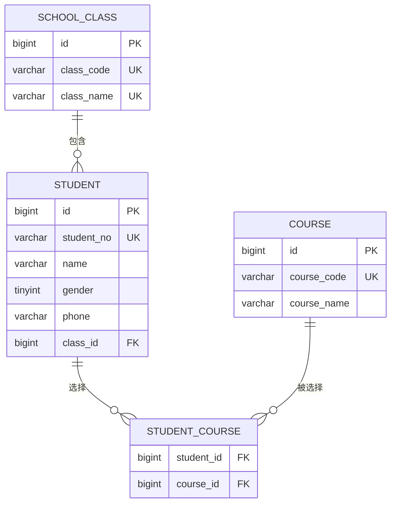

# 学生信息管理系统需求文档

> 文档版本：V1.1  
> 编写日期：2026-07-23  
> 项目路径：`springboot-demo`  
> 文档状态：第一期需求基线

## 1. 项目背景

当前 `springboot-demo` 已具备 Spring Boot Web、MyBatis-Plus、参数校验、统一响应、全局异常处理、TraceId、Knife4j/Swagger、ECS MySQL dev/test配置以及 MockMvc 测试能力。

本项目将在现有后端脚手架上，将原有的示例用户 CRUD 业务替换为一个学生信息管理系统。项目参考《Spring Boot 从入门到实战》第17章的业务框架，但不照搬书中的 Thymeleaf 页面和旧式接口设计，而是按照前后端分离的 REST 接口方式重新设计。

## 2. 建设目标

第一期建设以下业务能力：

- 固定管理员账号登录和退出登录。
- 学生信息的分页查询、详情、新增、修改和删除。
- 课程信息的查询、新增、修改和删除。
- 班级信息的查询、新增、修改和删除。
- 建立学生、班级和课程之间的业务关系。
- 保持统一响应、参数校验、业务异常、TraceId、接口文档和自动化测试能力。

第一期完成后，管理员能够通过前端页面、Knife4j 或 Postman 完成学生信息管理的主要业务流程。

## 3. 用户角色

第一期只有一种系统使用角色：管理员。

管理员拥有以下权限：

- 登录管理后台。
- 退出登录。
- 管理学生、课程和班级数据。

第一期只提供一个固定管理员账号，不提供管理员注册、新增、删除、修改密码、角色分配和菜单权限配置功能。固定管理员的用户名和密码哈希通过服务器环境变量或安全配置提供，不写入 Java 代码，不提交到代码仓库，也不保存在业务数据库中。需要轮换密码时，由运维人员更新服务器安全配置并重启应用。

学生是被管理的业务数据，不是第一期的系统登录账号，因此学生表不保存登录密码。

## 4. 业务范围

### 4.1 业务模块

第一期包含4个业务模块，共15个接口。

| 模块 | 功能 | 接口数量 |
| --- | --- | ---: |
| 登录权限 | 登录、退出 | 2 |
| 学生管理 | 分页查询、详情、新增、修改、删除 | 5 |
| 课程管理 | 查询、新增、修改、删除 | 4 |
| 班级管理 | 查询、新增、修改、删除 | 4 |
| 合计 |  | 15 |

### 4.2 业务关系

关系约定：

- 一个班级可以包含多个学生。
- 一个学生第一期只能归属于一个班级。
- 一个学生可以选择多门课程。
- 一门课程可以被多个学生选择。
- 学生和课程的多对多关系由学生课程关联表维护。

## 5. 功能需求

### 5.1 登录权限模块

#### 5.1.1 管理员登录

- 管理员使用用户名和密码登录。
- 用户名和密码均不能为空。
- 系统使用服务器安全配置中的固定管理员用户名和密码哈希校验登录信息。
- 用户名不存在或密码错误时均登录失败。
- 登录失败信息不应向客户端区分“用户名不存在”和“密码错误”，统一提示用户名或密码错误。
- 登录成功后返回后续访问受保护接口所需的认证凭证。
- 除登录接口和接口文档所需地址外，业务接口均要求管理员已登录。

#### 5.1.2 退出登录

- 已登录管理员可以主动退出登录。
- 退出成功后，当前认证凭证应立即失效。
- 失效凭证再次访问业务接口时，系统返回未登录或登录已失效错误。

### 5.2 学生管理模块

#### 5.2.1 分页查询学生

支持以下查询条件：

- `pageNo`：页码，默认1，最小1。
- `pageSize`：每页数量，默认10，最小1，最大100。
- `keyword`：可选，同时模糊匹配学号和姓名。
- `classId`：可选，按班级筛选。
- `courseId`：可选，按所选课程筛选。

查询规则：

- 默认按照创建时间倒序排列。
- 已逻辑删除的学生不返回。
- 无匹配数据时，分页记录返回空数组，不返回 `null`。
- 返回内容应包含记录列表、总记录数、当前页码、每页数量和总页数。

#### 5.2.2 查询学生详情

- 根据学生主键 ID 查询学生详情。
- 返回学生基础信息、所属班级和已选课程。
- 学生不存在或已被逻辑删除时，返回“学生不存在”业务错误。

#### 5.2.3 新增学生

新增学生至少录入以下信息：

| 字段 | 是否必填 | 规则 |
| --- | --- | --- |
| 学号 `studentNo` | 是 | 长度2～32个字符，全局唯一，去除首尾空格 |
| 姓名 `name` | 是 | 长度1～50个字符，去除首尾空格 |
| 性别 `gender` | 是 | `0`未知、`1`男、`2`女 |
| 手机号 `phone` | 否 | 最长20个字符；填写时必须符合手机号格式要求 |
| 班级 `classId` | 是 | 班级必须存在且未删除 |
| 课程 `courseIds` | 否 | 数组元素不能重复，课程必须存在且未删除 |

业务规则：

- 学号忽略大小写判重。
- 已逻辑删除学生使用过的学号不能再次使用。
- 学生基础信息和课程关联关系必须在同一事务中保存。
- 任一班级或课程无效时，整个新增操作失败，不能产生部分数据。

#### 5.2.4 修改学生

- 根据学生主键 ID 修改学生信息。
- 修改字段和校验规则与新增学生一致。
- 修改学号时，需要排除当前学生后进行唯一性校验。
- 修改课程时，以本次提交的 `courseIds` 作为学生最新课程集合。
- 不允许客户端修改主键、创建时间、更新时间和逻辑删除字段。
- 学生不存在或已删除时不允许修改。

#### 5.2.5 删除学生

- 根据学生主键 ID 逻辑删除学生。
- 删除学生时同步清理或失效该学生的课程关联关系。
- 删除后，分页和详情接口均不能再查询到该学生。
- 重复删除同一个学生时返回“学生不存在”业务错误。
- 删除后原学号仍然保留，不允许新学生重复使用。

### 5.3 课程管理模块

#### 5.3.1 查询课程

- 支持分页查询课程。
- 支持按照课程编码或课程名称进行关键字查询。
- 默认按照创建时间倒序排列。
- 已逻辑删除的课程不返回。
- 查询结果同时供课程管理页面和学生表单选择课程使用。

#### 5.3.2 新增课程

| 字段 | 是否必填 | 规则 |
| --- | --- | --- |
| 课程编码 `courseCode` | 是 | 长度2～32个字符，全局唯一，去除首尾空格 |
| 课程名称 `courseName` | 是 | 长度1～100个字符，去除首尾空格 |

- 课程编码忽略大小写判重。
- 已逻辑删除课程使用过的课程编码不能再次使用。

#### 5.3.3 修改课程

- 根据课程主键 ID 修改课程编码和课程名称。
- 修改课程编码时，需要排除当前课程后进行唯一性校验。
- 修改课程不会改变课程 ID，也不会破坏已有学生课程关系。
- 课程不存在或已删除时不允许修改。

#### 5.3.4 删除课程

- 根据课程主键 ID 逻辑删除课程。
- 仍有学生关联该课程时不允许删除，并返回明确业务提示。
- 删除后课程不能出现在课程列表和学生课程选择项中。
- 重复删除时返回“课程不存在”业务错误。

### 5.4 班级管理模块

#### 5.4.1 查询班级

- 支持分页查询班级。
- 支持按照班级编码或班级名称进行关键字查询。
- 默认按照创建时间倒序排列。
- 已逻辑删除的班级不返回。
- 查询结果同时供班级管理页面和学生表单选择班级使用。

#### 5.4.2 新增班级

| 字段 | 是否必填 | 规则 |
| --- | --- | --- |
| 班级编码 `classCode` | 是 | 长度2～32个字符，全局唯一，去除首尾空格 |
| 班级名称 `className` | 是 | 长度1～100个字符，全局唯一，去除首尾空格 |

- 班级编码和班级名称均忽略大小写判重。
- 已逻辑删除班级使用过的编码和名称不能再次使用。

#### 5.4.3 修改班级

- 根据班级主键 ID 修改班级编码和名称。
- 唯一性校验需要排除当前班级。
- 修改班级不会改变班级 ID，也不会破坏已有学生班级关系。
- 班级不存在或已删除时不允许修改。

#### 5.4.4 删除班级

- 根据班级主键 ID 逻辑删除班级。
- 班级下仍存在未删除学生时不允许删除，并返回明确业务提示。
- 删除后班级不能出现在班级列表和学生班级选择项中。
- 重复删除时返回“班级不存在”业务错误。

## 6. 接口需求清单

### 6.1 登录权限接口

| 序号 | 方法 | 路径 | 功能 |
| ---: | --- | --- | --- |
| 1 | `POST` | `/api/v1/auth/login` | 管理员登录 |
| 2 | `POST` | `/api/v1/auth/logout` | 管理员退出登录 |

### 6.2 学生管理接口

| 序号 | 方法 | 路径 | 功能 |
| ---: | --- | --- | --- |
| 3 | `GET` | `/api/v1/students` | 分页查询学生 |
| 4 | `GET` | `/api/v1/students/{id}` | 查询学生详情 |
| 5 | `POST` | `/api/v1/students` | 新增学生 |
| 6 | `PUT` | `/api/v1/students/{id}` | 修改学生 |
| 7 | `DELETE` | `/api/v1/students/{id}` | 删除学生 |

### 6.3 课程管理接口

| 序号 | 方法 | 路径 | 功能 |
| ---: | --- | --- | --- |
| 8 | `GET` | `/api/v1/courses` | 查询课程 |
| 9 | `POST` | `/api/v1/courses` | 新增课程 |
| 10 | `PUT` | `/api/v1/courses/{id}` | 修改课程 |
| 11 | `DELETE` | `/api/v1/courses/{id}` | 删除课程 |

### 6.4 班级管理接口

| 序号 | 方法 | 路径 | 功能 |
| ---: | --- | --- | --- |
| 12 | `GET` | `/api/v1/classes` | 查询班级 |
| 13 | `POST` | `/api/v1/classes` | 新增班级 |
| 14 | `PUT` | `/api/v1/classes/{id}` | 修改班级 |
| 15 | `DELETE` | `/api/v1/classes/{id}` | 删除班级 |

## 7. 通用业务规则

### 7.1 数据状态

- 学生、课程和班级均包含创建时间和更新时间。
- 学生、课程和班级采用逻辑删除。
- 普通查询默认只访问未删除数据。
- 逻辑删除记录占用的唯一业务编码不允许再次使用。

### 7.2 参数校验

- 所有必填字段必须在接口入口完成校验。
- 字符串保存前统一去除首尾空格。
- 主键 ID 必须大于0。
- 非法枚举、分页参数、手机号和不存在的关联 ID 均返回参数或业务错误。
- 前端不能传入或覆盖系统维护字段。

### 7.3 分页规则

- 统一使用 `pageNo` 和 `pageSize`。
- `pageNo` 默认1，`pageSize` 默认10。
- `pageSize` 最大100，避免一次查询过多数据。
- 分页响应至少包含 `records`、`total`、`pageNo`、`pageSize` 和 `pages`。

### 7.4 统一响应和异常

- 所有业务接口继续使用现有 `Response<T>` 统一响应结构。
- 成功、参数错误、未登录、无权限、数据不存在、数据重复、关联数据限制和系统异常必须使用可区分的业务错误码。
- 系统异常不能向客户端返回数据库连接、SQL、堆栈或服务器路径等敏感信息。
- 每次请求继续生成或透传 TraceId，并在响应和日志中保持一致。

### 7.5 数据一致性

- 新增或修改学生及其课程关系时必须使用事务。
- 数据库使用唯一索引保证学号、课程编码、班级编码和班级名称唯一。
- 应用层在写入前提供友好的重复数据提示，数据库约束作为最终保护。
- 删除课程或班级前必须检查关联数据，不能产生无效外键或孤立业务数据。

## 8. 安全需求

- 除登录接口和必要的接口文档资源外，所有业务接口均要求认证。
- 固定管理员用户名和密码哈希必须通过服务器环境变量或安全配置提供。
- 管理员密码必须使用适合密码存储的单向哈希算法处理，不允许在代码、配置仓库和日志中出现明文密码，也不允许使用普通 MD5。
- 管理员密码轮换通过更新服务器安全配置并重启应用完成。
- 认证凭证不允许记录在普通业务日志中。
- 退出登录后，当前认证凭证必须立即失效。
- 登录接口应具备基础的失败频率限制，具体实现方案在技术设计文档中确定。
- 认证使用 Spring Security；JWT、Redis Token 或其他凭证实现方案在技术设计文档中确定。
- 第一阶段不实现多角色 RBAC，但代码结构应允许以后增加权限控制。

## 9. 非功能需求

### 9.1 接口文档

- 15个接口均应在 Knife4j/Swagger 中可查看和调试。
- 接口文档需要描述请求字段、校验规则、响应字段和主要错误码。

### 9.2 自动化测试

- 每个模块至少覆盖正常流程、参数校验、数据不存在和唯一性冲突。
- 学生模块需要覆盖班级不存在、课程不存在、课程重复和关联更新。
- 课程和班级模块需要覆盖“存在关联数据时禁止删除”。
- 登录模块需要覆盖登录成功、密码错误、未登录访问受保护接口和退出后凭证失效。
- 测试继续使用 JUnit 5、MockMvc 和 test profile；test与 dev复用 ECS MySQL，通过唯一测试数据和事务回滚控制影响。

### 9.3 可维护性

- 继续采用 `Controller → Form/Query → Service → DAO → Mapper → Database` 分层。
- 数据库对象不直接返回前端，使用 Form、Query 和 VO 隔离输入输出。
- Controller 只负责路由、参数接收和统一响应，不直接编写业务和数据库逻辑。
- 公共响应、异常、TraceId、跨域、Swagger 和测试脚手架继续复用。

## 10. 第一期不包含的功能

以下内容不在第一期范围内：

- 管理员账号增删改查。
- 管理员注册、修改密码和忘记密码。
- 角色、菜单和按钮级权限管理。
- 学生登录。
- 成绩、考试和教师管理。
- 学生头像和文件上传。
- Excel批量导入、导出。
- 批量删除学生、课程或班级。
- 数据统计图表和首页看板。
- 多学校、多租户和多数据源。
- 消息队列、搜索引擎和分布式任务。
- Actuator可视化监控平台。

这些能力只有在第一期验收完成并出现明确业务需求后再进入后续迭代。

## 11. 现有脚手架迁移范围

正式开发时，移除原有示例用户业务代码和 `demo_user` 示例表，包括 `UserController`、`UserService`、`UserDao`、`UserMapper`、`UserDO`、用户 Form 和用户 VO。

以下公共能力继续保留并复用：

- Spring Boot Web和参数校验。
- MyBatis-Plus和数据库环境配置。
- `Response<T>`统一响应。
- `BaseException`和全局异常处理。
- TraceId和请求日志。
- Knife4j/Swagger。
- ECS MySQL dev/test配置及 MockMvc测试结构。

需求文档阶段不删除现有代码或数据库对象；删除和替换操作在技术设计、数据库脚本和开发任务确认后执行。

## 12. 第一期验收标准

满足以下条件视为第一期后端验收通过：

1. 15个接口均已实现，并能够通过 Knife4j/Postman调用。
2. 固定管理员可以登录和退出，退出后凭证立即失效。
3. 学生分页、详情、新增、修改和删除流程正常。
4. 课程和班级能够查询、新增、修改和删除。
5. 学生能够正确关联一个班级和多门课程。
6. 无效班级、无效课程和重复业务编码能够返回明确错误。
7. 有学生关联时，课程和班级不能被删除。
8. 所有删除均为逻辑删除，删除数据不会出现在正常查询中。
9. 统一响应、参数校验、业务异常和 TraceId 行为一致。
10. 关键业务规则具备自动化测试；测试数据使用唯一标识并通过事务回滚，不清理或修改已有开发数据。

## 13. 后续文档

本需求文档确认后，再分别编写：

1. 数据库设计文档和建表/迁移 SQL。
2. 接口详细设计文档，包括请求、响应和错误码。
3. 登录鉴权技术方案。
4. 后端开发任务拆分和实施顺序。

在上述设计完成前，不开始删除现有用户示例模块或修改业务数据库。
