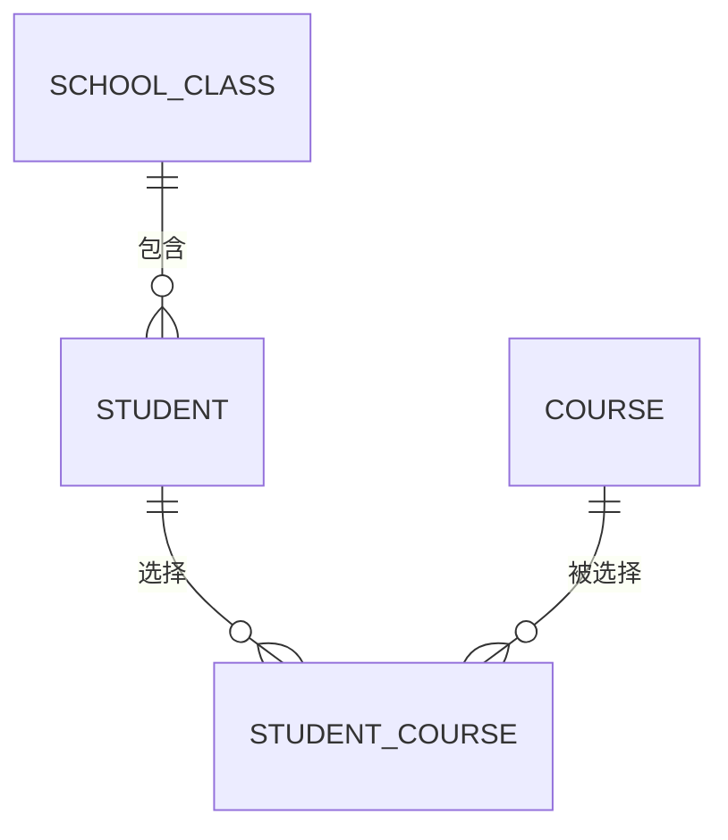

# 学生信息管理系统需求文档

> 文档版本：V1.7
> 编写日期：2026-07-23  
> 项目路径：`springboot-demo`  
> 文档状态：第一期需求基线

## 1. 项目背景

当前 `springboot-demo` 已具备 Spring Boot Web、MyBatis-Plus、参数校验、统一响应、全局异常处理、TraceId、Knife4j/Swagger、ECS MySQL dev/test配置以及 MockMvc 测试能力。

本项目将在现有后端脚手架上，将原有的示例用户 CRUD 业务替换为一个学生信息管理系统。项目参考《Spring Boot 从入门到实战》第17章的业务框架，但不照搬书中的 Thymeleaf 页面和旧式接口设计，而是按照前后端分离的 REST 接口方式重新设计。

本文只定义学生、课程和班级相关的业务需求。登录鉴权作为脚手架公共技术能力单独设计和实现，不纳入本文的业务模块、接口数量和验收范围。

## 2. 建设目标

第一期建设以下业务能力：

- 学生信息的分页查询、详情、新增、修改和删除。
- 课程信息的全量查询、新增、修改和删除。
- 班级信息的全量查询、新增、修改和删除。
- 建立学生、班级和课程之间的业务关系。
- 保持统一响应、参数校验、业务异常、TraceId、接口文档和自动化测试能力。

第一期完成后，后台使用者能够通过前端页面、Knife4j 或 Postman 完成学生信息管理的主要业务流程。

## 3. 用户角色

第一期业务操作角色为后台管理员，可以管理学生、课程和班级数据。

学生是被管理的业务数据，不是第一期的系统操作角色。管理员身份识别、登录状态和访问控制不属于本文讨论范围。

## 4. 业务范围

### 4.1 业务模块

第一期包含3个业务模块，共13个接口。

| 模块 | 功能 | 接口数量 |
| --- | --- | ---: |
| 学生管理 | 分页查询、详情、新增、修改、删除 | 5 |
| 课程管理 | 全量查询、新增、修改、删除 | 4 |
| 班级管理 | 全量查询、新增、修改、删除 | 4 |
| 合计 |  | 13 |

### 4.2 业务关系

关系约定：

- 一个班级可以包含多个学生。
- 一个学生第一期必须且只能归属于一个有效班级。
- 一个学生可以选择多门课程。
- 一门课程可以被多个学生选择。
- 学生和课程的多对多关系由学生课程关联表维护。
- 学生课程关联表只保存当前选课关系，不保存成绩、学期、选课状态和历史记录。
- 同一个学生不能重复选择同一门课程。

本节只表达业务实体及其关系。物理表字段、数据类型、默认值、索引、外键和 DDL 统一以[《学生信息管理系统数据库设计》](./学生信息管理系统数据库设计.md)为准。

## 5. 功能需求

### 5.1 学生管理模块

#### 5.1.1 分页查询学生

支持以下查询条件：

- `pageNum`：页码，必填，最小1。
- `pageSize`：每页数量，必填，最小1。
- `keyword`：可选，同时模糊匹配学号和姓名。
- `classId`：可选，按班级筛选。
- `courseId`：可选，按所选课程筛选。

查询规则：

- 默认按照创建时间倒序排列。
- 已逻辑删除的学生不返回。
- 无匹配数据时，分页记录返回空数组，不返回 `null`。
- 返回内容应包含记录列表、总记录数、当前页码、每页数量和总页数。

#### 5.1.2 查询学生详情

- 根据学生主键 ID 查询学生详情。
- 返回学生基础信息、所属班级和已选课程。
- 学生不存在或已被逻辑删除时，返回“学生不存在”业务错误。

#### 5.1.3 新增学生

新增学生至少录入以下信息：

| 字段 | 是否必填 | 规则 |
| --- | --- | --- |
| 学号 `studentNo` | 是 | 长度2～32个字符，全局唯一，去除首尾空格，英文字母统一转为大写 |
| 姓名 `name` | 是 | 长度1～50个字符，去除首尾空格 |
| 性别 `gender` | 是 | `0`未知、`1`男、`2`女 |
| 手机号 `phone` | 否 | 最长20个字符；填写时必须符合手机号格式要求，允许不同学生重复使用 |
| 班级 `classId` | 是 | 班级必须存在且未删除 |
| 课程 `courseIds` | 否 | 数组元素不能重复，课程必须存在且未删除 |

业务规则：

- 学号保存前去除首尾空格，英文字母统一转为大写，并忽略大小写判重。
- 已逻辑删除学生使用过的学号不能再次使用。
- 学号创建后不可通过普通修改接口变更。
- 学生基础信息和课程关联关系必须在同一事务中保存。
- 任一班级或课程无效时，整个新增操作失败，不能产生部分数据。

#### 5.1.4 修改学生

- 根据学生主键 ID 修改学生信息。
- 允许修改姓名、性别、手机号、所属班级和课程集合，校验规则与新增学生一致。
- 学号不属于普通修改接口的可修改字段。
- 修改课程时，以本次提交的 `courseIds` 作为学生最新课程集合。
- 不允许客户端修改主键、创建时间、更新时间和逻辑删除字段。
- 学生不存在或已删除时不允许修改。

#### 5.1.5 删除学生

- 根据学生主键 ID 逻辑删除学生。
- 删除学生时，在同一事务中物理删除该学生的课程关联关系。
- 删除后，分页和详情接口均不能再查询到该学生。
- 重复删除同一个学生时返回“学生不存在”业务错误。
- 删除后原学号仍然保留，不允许新学生重复使用。

### 5.2 课程管理模块

#### 5.2.1 查询课程

- 不接收 `pageNum`、`pageSize`，直接返回全部未删除课程。
- 支持按照课程编码或课程名称进行关键字查询。
- 默认按照创建时间倒序排列。
- 已逻辑删除的课程不返回。
- 查询结果同时供课程管理页面和学生新增、修改表单的课程选择项使用。
- 第一期开课数据属于小型基础数据；后续数据规模明显增大时再改为远程分页搜索。

#### 5.2.2 新增课程

| 字段 | 是否必填 | 规则 |
| --- | --- | --- |
| 课程编码 `courseCode` | 是 | 长度2～32个字符，全局唯一，去除首尾空格，英文字母统一转为大写 |
| 课程名称 `courseName` | 是 | 长度1～100个字符，去除首尾空格 |

- 课程编码保存前去除首尾空格，英文字母统一转为大写，并忽略大小写判重。
- 课程名称允许重复，不作为业务唯一标识。
- 已逻辑删除课程使用过的课程编码不能再次使用。

#### 5.2.3 修改课程

- 根据课程主键 ID 修改课程编码和课程名称。
- 修改课程编码时，需要排除当前课程后进行唯一性校验。
- 修改课程不会改变课程 ID，也不会破坏已有学生课程关系。
- 课程不存在或已删除时不允许修改。

#### 5.2.4 删除课程

- 根据课程主键 ID 逻辑删除课程。
- 仍有学生关联该课程时不允许删除，并返回明确业务提示。
- 删除后课程不能出现在课程列表和学生课程选择项中。
- 重复删除时返回“课程不存在”业务错误。

### 5.3 班级管理模块

#### 5.3.1 查询班级

- 不接收 `pageNum`、`pageSize`，直接返回全部未删除班级。
- 支持按照班级编码或班级名称进行关键字查询。
- 默认按照创建时间倒序排列。
- 已逻辑删除的班级不返回。
- 查询结果同时供班级管理页面和学生新增、修改表单的班级选择项使用。
- 第一期班级数据属于小型基础数据；后续数据规模明显增大时再改为远程分页搜索。

#### 5.3.2 新增班级

| 字段 | 是否必填 | 规则 |
| --- | --- | --- |
| 班级编码 `classCode` | 是 | 长度2～32个字符，全局唯一，去除首尾空格，英文字母统一转为大写 |
| 班级名称 `className` | 是 | 长度1～100个字符，去除首尾空格，允许重复 |

- 班级编码保存前去除首尾空格，英文字母统一转为大写，并忽略大小写判重。
- 班级名称用于展示，不作为业务唯一标识。
- 已逻辑删除班级使用过的班级编码不能再次使用。

#### 5.3.3 修改班级

- 根据班级主键 ID 修改班级编码和名称。
- 修改班级编码时，唯一性校验需要排除当前班级。
- 修改班级不会改变班级 ID，也不会破坏已有学生班级关系。
- 班级不存在或已删除时不允许修改。

#### 5.3.4 删除班级

- 根据班级主键 ID 逻辑删除班级。
- 班级下仍存在未删除学生时不允许删除，并返回明确业务提示。
- 删除后班级不能出现在班级列表和学生班级选择项中。
- 重复删除时返回“班级不存在”业务错误。

## 6. 接口需求清单

### 6.1 学生管理接口

| 序号 | 方法 | 路径 | 功能 |
| ---: | --- | --- | --- |
| 1 | `GET` | `/api/v1/students` | 分页查询学生 |
| 2 | `GET` | `/api/v1/students/{id}` | 查询学生详情 |
| 3 | `POST` | `/api/v1/students` | 新增学生 |
| 4 | `PUT` | `/api/v1/students/{id}` | 修改学生 |
| 5 | `DELETE` | `/api/v1/students/{id}` | 删除学生 |

### 6.2 课程管理接口

| 序号 | 方法 | 路径 | 功能 |
| ---: | --- | --- | --- |
| 6 | `GET` | `/api/v1/courses` | 查询全部课程 |
| 7 | `POST` | `/api/v1/courses` | 新增课程 |
| 8 | `PUT` | `/api/v1/courses/{id}` | 修改课程 |
| 9 | `DELETE` | `/api/v1/courses/{id}` | 删除课程 |

### 6.3 班级管理接口

| 序号 | 方法 | 路径 | 功能 |
| ---: | --- | --- | --- |
| 10 | `GET` | `/api/v1/classes` | 查询全部班级 |
| 11 | `POST` | `/api/v1/classes` | 新增班级 |
| 12 | `PUT` | `/api/v1/classes/{id}` | 修改班级 |
| 13 | `DELETE` | `/api/v1/classes/{id}` | 删除班级 |

## 7. 通用业务规则

### 7.1 数据状态

- 学生、课程和班级均包含创建时间和更新时间。
- 学生、课程和班级采用逻辑删除。
- 学生课程关系删除后不保留历史记录。
- 普通查询默认只访问未删除数据。
- 逻辑删除记录占用的唯一业务编码不允许再次使用。

### 7.2 参数校验

- 所有必填字段必须在接口入口完成校验。
- 字符串保存前统一去除首尾空格。
- 学号、课程编码和班级编码中的英文字母统一转换为大写。
- 主键 ID 必须大于0。
- 非法枚举、分页参数、手机号和不存在的关联 ID 均返回参数或业务错误。
- 前端不能传入或覆盖系统维护字段。

### 7.3 分页规则

- 第一期只有学生查询使用分页。
- 学生分页请求使用 `pageNum` 和 `pageSize`，两个参数均必填且最小值为1。
- 学生分页响应包含 `pageNum`、`pageSize`、`total`、`pages`、`list` 和 `boolLastPage`。
- 学生分页接口不支持 `all`、`pageSize = 0` 或其他“查全部”特殊值。
- 不传学生业务筛选条件表示分页查询全部学生数据范围，仍然只返回当前页。
- 课程和班级查询不接收分页参数，直接返回全量列表。

### 7.4 统一响应和异常

- 所有业务接口继续使用现有 `Response<T>` 统一响应结构。
- 成功、参数错误、鉴权错误和系统异常沿用脚手架现有状态码。
- 学生、班级和课程模块的已知业务失败统一使用 `code = 2`，通过明确的 `msg` 区分不存在、重复和关联限制。
- 系统异常不能向客户端返回数据库连接、SQL、堆栈或服务器路径等敏感信息。
- 每次请求继续生成或透传 TraceId，并在响应和日志中保持一致。

### 7.5 数据一致性

- 新增或修改学生及其课程关系时必须使用事务。
- 数据库层必须保证学号、课程编码和班级编码唯一，并防止产生重复选课关系。
- 数据库层和应用层共同保证学生、班级和课程关联数据的有效性。
- 应用层在写入前提供友好的重复数据提示，数据库约束作为最终保护。
- 删除学生时逻辑删除学生并物理删除其选课关系；删除课程或班级前必须检查关联数据，不能产生无效关联或孤立业务数据。

## 8. 非功能需求

### 8.1 接口文档

- 13个业务接口均应在 Knife4j/Swagger 中可查看和调试。
- 接口文档需要描述请求字段、校验规则、响应字段和主要错误码。

### 8.2 自动化测试

- 每个模块至少覆盖正常流程、参数校验、数据不存在和唯一性冲突。
- 学生模块需要覆盖班级不存在、课程不存在、课程重复和关联更新。
- 课程和班级模块需要覆盖“存在关联数据时禁止删除”。
- 测试继续使用 JUnit 5、MockMvc 和 test profile；test与 dev复用 ECS MySQL，通过唯一测试数据和事务回滚控制影响。

### 8.3 可维护性

- 继续采用 `Controller → Form/Query → Service → DAO → Mapper → Database` 分层。
- 数据库对象不直接返回前端，使用 Form、Query 和 VO 隔离输入输出。
- Controller 只负责路由、参数接收和统一响应，不直接编写业务和数据库逻辑。
- 公共响应、异常、TraceId、跨域、Swagger 和测试脚手架继续复用。

## 9. 第一期不包含的业务功能

以下内容不在第一期范围内：

- 成绩、考试和教师管理。
- 学生头像和文件上传。
- Excel批量导入、导出。
- 批量删除学生、课程或班级。
- 数据统计图表和首页看板。
- 多学校、多租户和多数据源。
- 消息队列、搜索引擎和分布式任务。
- Actuator可视化监控平台。

这些能力只有在第一期验收完成并出现明确业务需求后再进入后续迭代。

## 10. 现有脚手架迁移范围

正式开发时，移除原有示例用户业务代码并停止初始化 `demo_user` 示例表，包括 `UserController`、`UserService`、`UserDao`、`UserMapper`、`UserDO`、用户 Form 和用户 VO。

以下公共能力继续保留并复用：

- Spring Boot Web和参数校验。
- MyBatis-Plus和数据库环境配置。
- `Response<T>`统一响应。
- `BaseException`和全局异常处理。
- TraceId和请求日志。
- Knife4j/Swagger。
- ECS MySQL dev/test配置及 MockMvc测试结构。

技术设计和开发范围确认后，删除原有示例用户业务代码；历史 `demo_user` 表不再被应用引用，数据库对象由后续受控迁移清理。

## 11. 第一期验收标准

满足以下条件视为第一期后端验收通过：

1. 13个业务接口均已实现，并能够通过 Knife4j/Postman调用。
2. 学生分页、详情、新增、修改和删除流程正常。
3. 课程和班级能够全量查询、新增、修改和删除，并可供学生表单选择。
4. 学生能够正确关联一个班级和多门课程。
5. 无效班级、无效课程和重复业务编码能够返回明确错误。
6. 有学生关联时，课程和班级不能被删除。
7. 学生、课程和班级使用逻辑删除；学生课程关联记录按约定物理删除，删除数据不会出现在正常查询中。
8. 统一响应、参数校验、业务异常和 TraceId 行为一致。
9. 关键业务规则具备自动化测试；测试数据使用唯一标识并通过事务回滚，不清理或修改已有开发数据。

## 12. 设计交付物

当前第一期开发基线包括：

1. 数据库设计文档：已完成。
2. 接口详细设计文档：已完成。
3. 版本化建表 SQL：已完成，执行前需要目标数据库账号具备建表权限。
4. 后端开发范围：按本文13个业务接口实施。

## 13. 第一期验收结果

2026年7月26日完成第一期验收：

1. 学生5个、课程4个、班级4个，共13个业务接口均已实现。
2. 12个 JUnit 5 + MockMvc 自动化测试全部通过，测试事务均已回滚。
3. 自动化测试覆盖正常流程、空分页、无课程、重复业务编码、无效班级、
   无效课程、关联删除限制、逻辑删除和物理删除约定。
4. Swagger JSON 已验证包含13个业务操作，Knife4j页面可通过测试环境访问。
5. ECS测试环境通过真实HTTP请求完成13个业务接口、登录、当前用户和退出登录验收。
6. 前端通过真实浏览器完成登录、学生录入、班级与课程选择、三个条件组合筛选、
   关联删除失败提示、删除刷新和Token过期跳转验收。
7. 响应头 `X-Trace-Id` 与响应体 `tid` 一致，空分页和空课程均返回约定结构。
8. 测试环境使用Docker Compose运行前后端，复用现有 `springboot_demo` 数据库，
   不对外暴露后端18763端口。
9. 临时管理员、Token以及 `E2E-*`、`UI-*` 联调数据均已清理。

上述结果满足第11节第一期后端验收标准。Postman不是本次验收的必选客户端；
真实浏览器、Vue Axios、MockMvc和直接HTTP请求已经覆盖相同接口行为。
